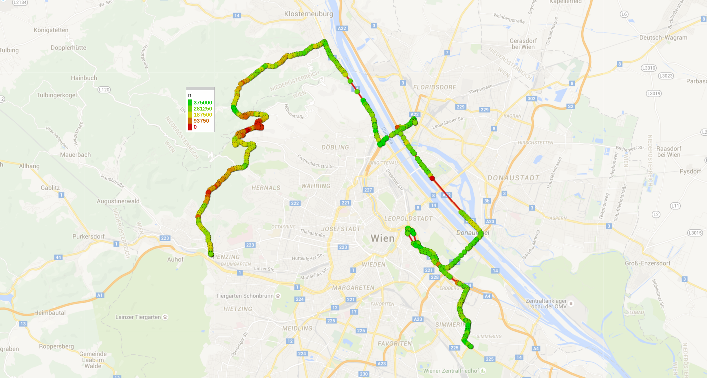
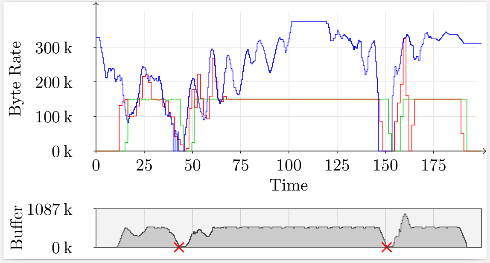
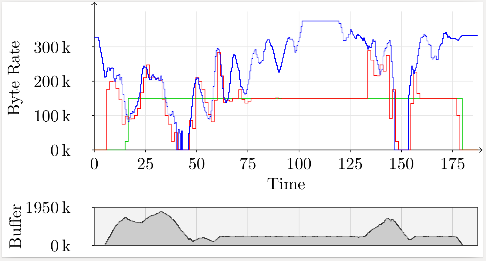

[Back](../README.md)

# Route 1
Route 1 shows good overall reception, with two phases of inferior network quality; one is likely caused by the area being rather remote, the second is caused by a tunnel entlang the Viennese A22 (Kaisermühlentunnel; 2.15 km).

## Run A
Run A shows two buffer underruns during those two periods of bad or interrupted connectivity.

[Show as PDF](./results-a.pdf)

## Run B
Run B shows no buffer overruns. Moreover, it is evident that the prefetching algorithm built up buffers before periods of bad connectivity, resulting in the desired prefetching.

[Show as PDF](./results-b.pdf)
