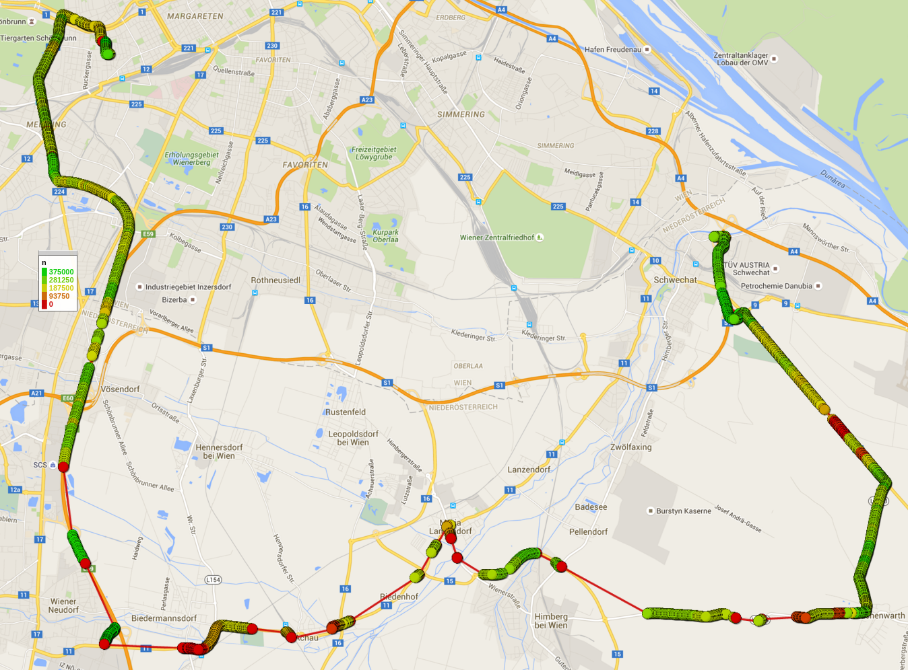
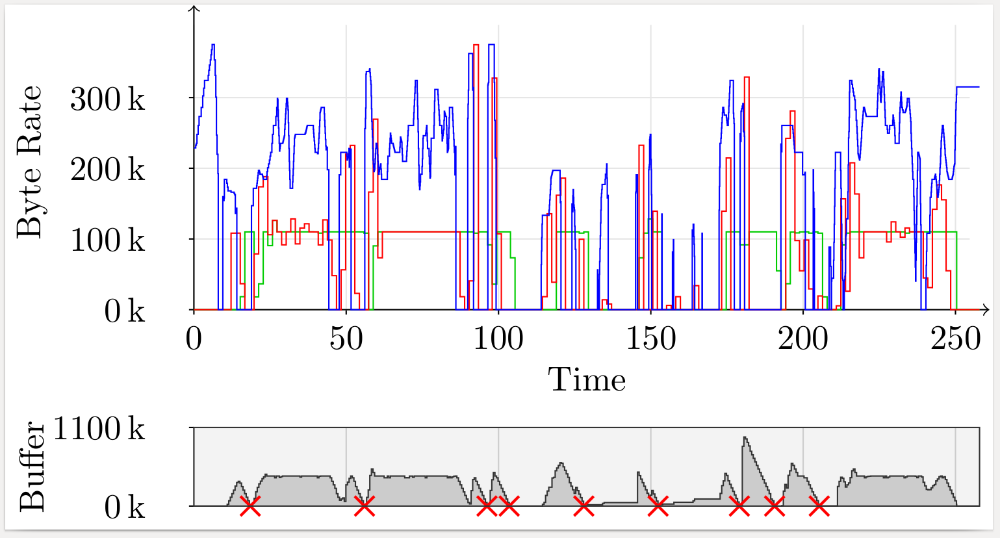
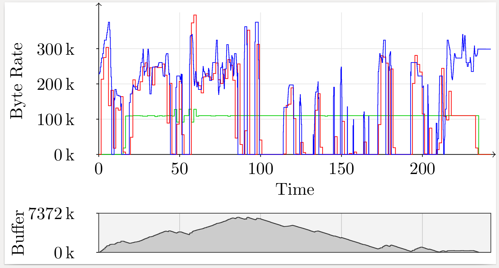

# Route 2
Route 3 has very bad characteristics regarding network quality. Especially after the route leaves the metropolitan area, longer periods of lacking connectivity start to appear.

## Run A
Run A shows 9 buffer underruns, caused mostly by the frequent disconnections.

[Show as PDF](./results-a.pdf)

## Run B
In run B, the prefetching algorithm managed to buffer just the right amount of data at the start, where reception is still of good quality. Run B shows no buffer underruns.

[Show as PDF](./results-b.pdf)
