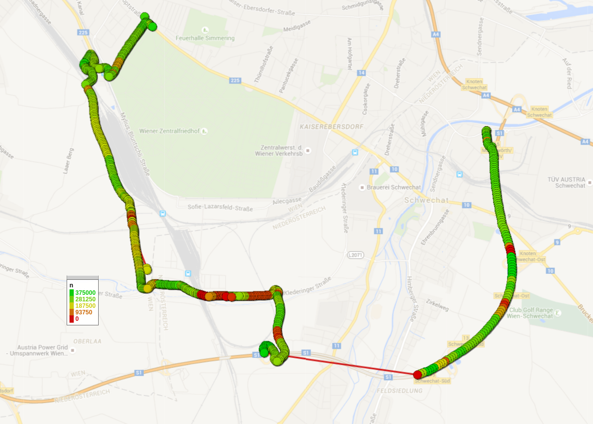
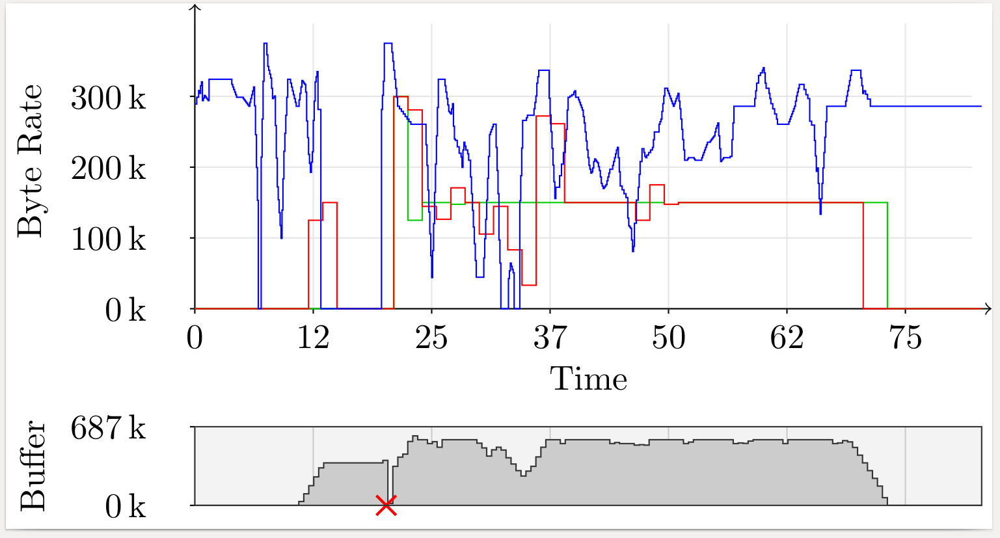
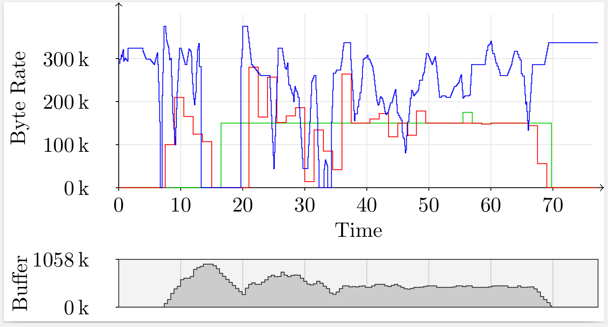

# Route 3
Route 3 also shows good overall reception, with one exception, namely a tunnel (Tunnel Rannersdorf, S1 Außenring Schnellstraße; 1.8 km), during which there was no connectivity.

## Run A
Run A shows a single buffer underrun, caused by the aforementioned tunnel.

[Show as PDF](./results-a.pdf)

## Run B
Run B shows no underruns.

[Show as PDF](./results-b.pdf)
